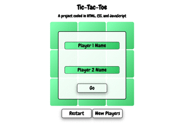

# Tic-Tac-Toe game project ❌⭕️❌

**A browser-based Tic-Tac-Toe game written in HTML, CSS, and JavaScript**.

**See it live at (https://rusty-reebs.github.io/tic-tac-toe/)!**

Date started: July 21, 2021  
Date completed: August 5, 2021

Objectives: use factory functions and module patterns to reduce global code.

### Screenshots
-----

### TIL Things I Learned
-----

- practiced using factory functions, methods, module patterns, IIFEs
- how to reference methods from other module patterns and factories
- how to check an array to see if it meets certain conditions